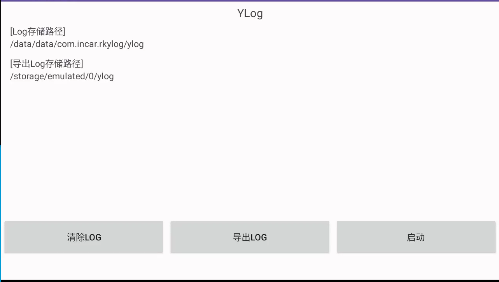

# RKYlog app
## user版本打印logcat 到指定文件 支持开机启动
## github 仓库：https://github.com/liujunjie00/RKYlog
## 一个主分支和一个ylog分支
    主分支 包括ylog功能和模仿华为充电动画的功能
    ylog  分支是较为纯净版本，去除动画
## 欢迎大家一起提交维护代码 记得stars
## 编译调试安装 技巧
    openssl pkcs8 -inform DER -nocrypt -in platform.pk8 -out platform.pem &&
    openssl pkcs12 -export -in platform.x509.pem -out platform.p12 -inkey platform.pem -password pass:888168 -name testKey &&
    keytool -importkeystore -deststorepass 888168 -destkeystore platform.jks -srckeystore platform.p12 -srcstoretype PKCS12 -srcstorepass 888168
### 去到对应的固件源码签名文件路径中执行，生成对应的platform.jks 替换本工程中的platform.jks就可以安装调试
### Rk3562 的签名源码路径为：device/rockchip/common/security/
## 内置到源码中
    android.mk指定变量：
    LOCAL_CERTIFICATE := PRESIGNED，打包apk时，沿用apk中原来的签名
    LOCAL_CERTIFICATE := media，适用于媒体/下载系统所包含的 apk 包的测试密钥
    LOCAL_CERTIFICATE := platform，适用于核心平台所包含的 apk 包的测试密钥
    LOCAL_CERTIFICATE := shared，适用于家庭/联系人进程中的共享内容的测试密钥
    LOCAL_CERTIFICATE := testkey，适用于未另外指定密钥的 apk 包的通用默认密钥
